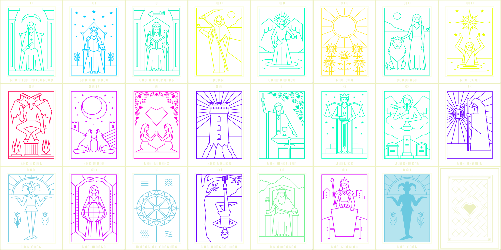

# Sayonara Wild Hearts - Misc files

## Music Highlightes

### Game Intro / Prolog

- [Falafel](music/music_falafel.wav)
- [Menu Intro](music/music_menu_intro01.wav): Only the intro part of Sayonara Wild Hearts, played as studio names shown
- [Menu Loop](music/music_menu_loop.wav): The rest of Sayonara Wild Hearts, menu selection background music

- [Clare De Lune (Menu)](music/music_clairedelune_menu.wav)
- [Clare De Lune](music/music_clairedelune.wav)

### Heartbreak Subspace - Devil Passage

- [Heart Break I (Menu)](music/music_hearttunnel_menu.wav)
- [Heart Break I](music/music_hearttunnel.wav)

### Hatehell Valley

- [Doki Doki Rush (Menu)](music/music_konichiwa_menu.wav)
- [Doki Doki Rush](music/music_konichiwa.wav)

- [Fighting Hearts (Menu)](music/music_fight_menu.wav)
- [Fighting Hearts](music/music_fight.wav)

- [Begin Again (Menu)](music/music_lasttime_menu.wav)
- [Begin Again](music/music_lasttime.wav)

### Heartbreak Subspace - Moon Passage

- [Heart Break II (Menu)](music/music_hearttunnel02_menu.wav)
- [Heart Break II](music/music_hearttunnel02.wav)

### Woe Woe Woods

- [Forest Ghost (Menu)](music/music_forest_menu.wav)
- [Forest Ghost (Intro)](music/music_forest_intro.wav)
- [Forest Ghost](music/music_forest.wav)

- [Forest Dub (Menu)](music/music_chase_menu.wav)
- [Forest Dub](music/music_chase.wav)

- [Laser Love (Menu)](music/music_shooter_menu.wav)
- [Laser Love](music/music_shooter.wav)

- [Dead of Night (Menu)](music/music_deadofnight_menu.wav)
- [Dead of Night](music/music_deadofnight.wav)

### Heartbreak Subspace - Tower of Lovers

- [Heart Break III (Menu)](music/music_tower_menu.wav)
- [Heart Break III](music/music_tower.wav)

### Twilight Cry Sky

- [Hearts & Swords (Menu)](music/music_loversintro_menu.wav)
- [Hearts & Swords (Intro)](music/music_loversintro_intro.wav)
- [Hearts & Swords](music/music_loversintro.wav)

- [Paralell Universe (Menu)](music/music_rhythmstage_menu.wav)
- [Paralell Universe](music/music_rhythmstage.wav)

- [Mine (Menu)](music/music_mine_menu.wav)
- [Mine (Intro)](music/music_mine_intro.wav)
- [Mine](music/music_mine.wav)

### Heartbreak Subspace - Hermit Warpway

- [Heart Break IV (Menu)](music/music_hearttunnel05_menu.wav)
- [Heart Break IV](music/music_hearttunnel05.wav)

### Desert of Doubts

- [Night Drift (Menu)](music/music_carstage_menu.wav)
- [Night Drift](music/music_carstage.wav)

- [Reverie (Menu)](music/music_virtual_menu.wav)
- [Reverie](music/music_virtual.wav)

- [The World We Knew (Menu)](music/twwk_menu.wav)
- [The World We Knew (Intro)](music/twwk_intro_.wav)
- [The World We Knew](music/twwk.wav)

### Heartbreak Subspace - Ocean of Death

- [Heart Break V (Menu)](music/music_ocean_menu.wav)
- [Heart Break V](music/music_ocean.wav)

### Lovedead City

- [Transonic Gravity (Menu)](music_gravity_menu.wav)
- [Transonic Gravity](music_gravity.wav)

- [Hate Skulls (Menu)](music/music_skulls_menu.wav)
- [Hate Skulls](music/music_skulls.wav)

- [Inside (Menu)](music/music_inside_menu.wav)
- [Inside](music/music_inside.wav)

### Bittersweet Starway / Heartbreak Subspace - Arcana Expressway / Somewhere over Malmö

- [Wild Hearts Never Die (Menu)](music/music_wildheartsneverdie_menu.wav)
- [Medley: Eye of Death / Wild Hearts Never Die / Clare De Lune](music/music_wildheartsneverdie.wav)

### Menu

- [Skip](music/music_skip.wav): The Magician Card
- [Locked](music/music_locked_menu.wav)
- [Pause](music/music_pause.wav)
- [Results](music/music_results.wav)
- [Settings](music/music_settings.wav)
- [Shuffle Bridge](music/music_shufflebridge.wav)

### Arcade

- [Congratulations](music/music_congratulations.wav)
- [Album Arcade](music/album.wav)
- [Yolo Arcade](music/album_yolo.wav)
- [Album Unlock](music/music_bonusunlock_album.wav)

### Zodiac Sign

- [Zodiac](music/music_zodiac.wav)
- [Zodiac Side B](music/music_zodiac_bside.wav)
- [Zodiac Unlock](music/music_bonusunlock_zodiac.wav)

## Image

## Font

- Trigot

## Text

Includes language files for platforms. Spoilers for Zodiac Sign Riddles Warning if you check them!
